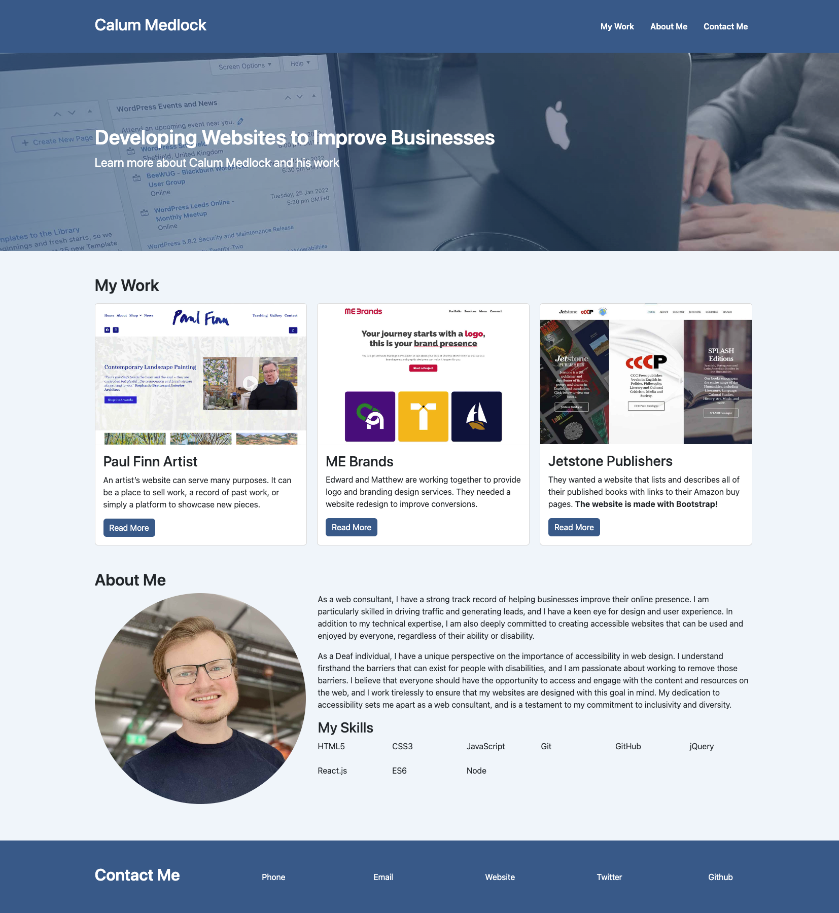

# Bootstrap-Portfolio

Welcome to my Bootstrap portfolio website! This website was created as part of the Bootstrap challenge assignment.

On this website, you can see my headline, my portfolio, an About Me section, and my contact information at the bottom.

To navigate the website, use the links in the navigation bar at the top. The portfolio section displays my work in a grid using Bootstrap cards, with a brief description of each project. The About Me section includes information about me and my background. The contact information at the bottom includes my email and links to my business website and social media profiles.

This website is licensed under the MIT license. There is no one to credit except for Bootstrap.

To view the deployed GitHub page, click [here](https://calummedlock.github.io/Bootstrap-Portfolio/). The following screenshot shows what the website looks like:

I hope you enjoy exploring my portfolio!